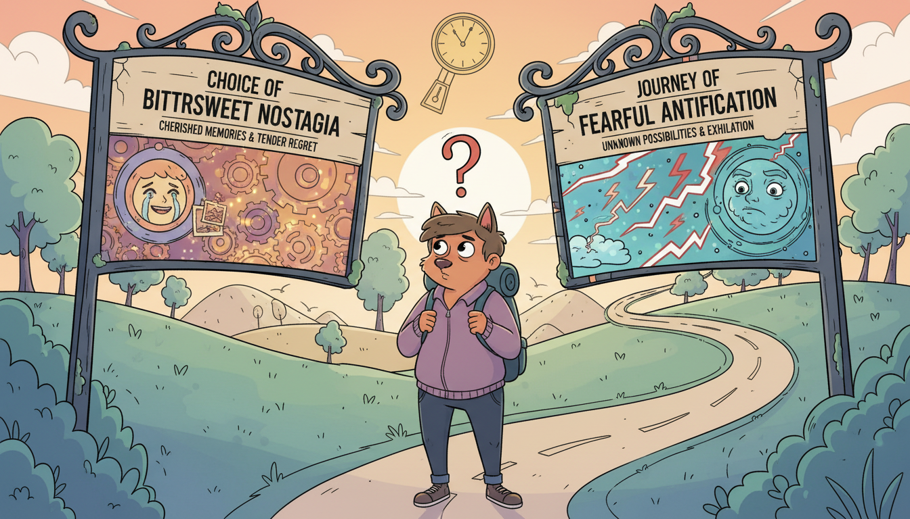
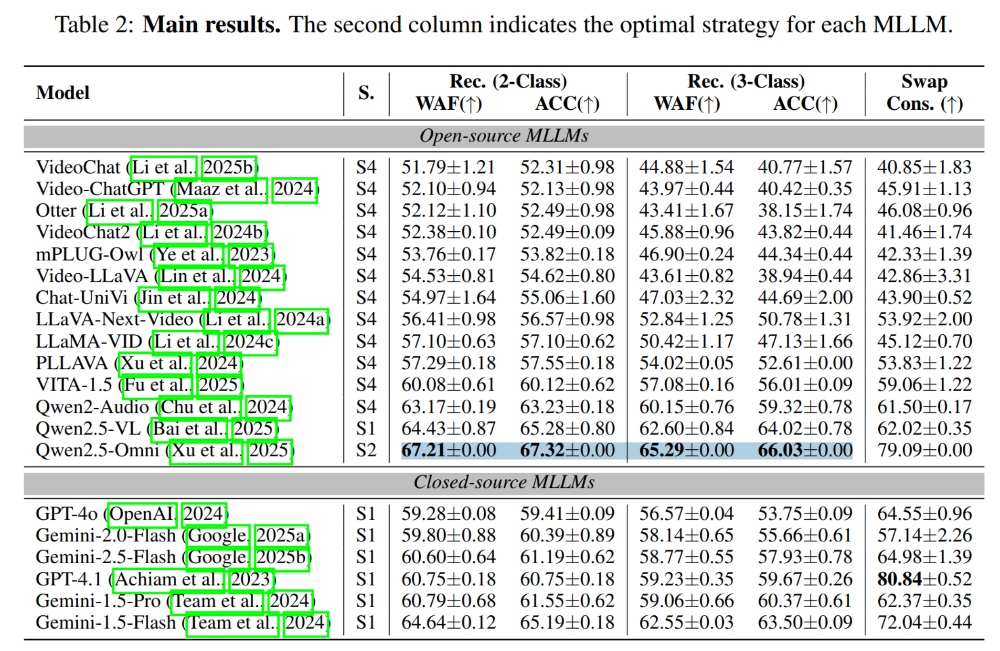

<p align="center">
    
<p>

<h3 align="center"><a href="https://arxiv.org/pdf/2507.04278" style="color:#9C276A">
EmoPrefer: Can Large Language Models Understand Human Emotion Preferences?</a></h3>
<h5 align="center"> If our project helps you, please give us a star ⭐ on GitHub to support us. 🙏🙏 </h2>


## 🛠️ Requirements and Installation
My Dependencies (We have not tested other envs):
* python == 3.10
* pytorch == 2.4.0
* CUDA Version == 12.1
* transformers == 4.49.0
* tokenizers == 0.21.0
* vllm == 0.6.1

**[Environment Preparation]**
```bash
conda env create -f environment.yml
```

## 🚀 EmoPrefer-Data
We introduce **EmoPrefer-Data**, the first multimodal preference dataset centered on human emotions. In this dataset, we provide pairwise emotion descriptions for videos and recruit multiple expert annotators to label preferences. Only samples with unanimous agreement among all annotators are retained, ensuring high-quality preference annotations.

```bash
dataset
├── video # available at: https://huggingface.co/datasets/MERChallenge/MER2025
├── audio # available at: https://huggingface.co/datasets/MERChallenge/MER2025
├── preference_emoprefer.csv # 574 pairs
├── preference_emoprefer_reverse.csv # calcuate swap consistency
├── preference_emoprefer_with_modelnames.csv # score calculation
```

## ✨ EmoPrefer-Data-V2
**EmoPrefer-Data-V2** is the extended version of **EmoPrefer-Data**. We expanded the annotator pool to 14 annotators and labeled an additional 2,096 samples. Different from **EmoPrefer-Data**, this dataset does not use majority vote, but use the origin annotations of each annotator.

```bash
dataset
├── video # available at: https://huggingface.co/datasets/MERChallenge/MER2025
├── audio # available at: https://huggingface.co/datasets/MERChallenge/MER2025
├── preference_emopreferv2.csv # 2096 pairs
├── preference_emopreferv2_reverse.csv # calcuate swap consistency
├── preference_emopreferv2_with_modelnames.csv # score calculation
```

## 🗝️ Inference

We take **Qwen2.5-Omni** as the model and **EmoPrefer-Data** as the dataset. 

#### Data and model preparation
```bash
dataset
├── video # available at: https://huggingface.co/datasets/MERChallenge/MER2025
├── audio # available at: https://huggingface.co/datasets/MERChallenge/MER2025
├── preference_emoprefer.csv # 574 pairs
├── preference_emoprefer_reverse.csv # calcuate swap consistency
├── preference_emoprefer_with_modelnames.csv # score calculation

models
├── Qwen2.5-Omni-7B # available at: https://huggingface.co/Qwen/Qwen2.5-Omni-7B
├── Qwen2.5-7B-Instruct # available at: https://huggingface.co/Qwen/Qwen2.5-7B-Instruct
```

#### Inference code
```bash
# Prompting Strategy 1: 
CUDA_VISIBLE_DEVICES=0 python -u main_dpo_batch.py --model='qwen25omni_7b' --input_type='audiovideo' 
--output_type='emoprefer' --prompt='normal' --llm='qwen25' --totalround=2

# Prompting Strategy 2: 
CUDA_VISIBLE_DEVICES=0 python -u main_dpo_batch.py --model='qwen25omni_7b' --input_type='audiovideo' 
--output_type='emoprefer' --prompt='cot'    --llm='qwen25' --totalround=2

# Prompting Strategy 3: 
CUDA_VISIBLE_DEVICES=0 python -u main_dpo_batch.py --model='qwen25omni_7b' --input_type='audiovideo' 
--output_type='emoprefer' --prompt='cot2'   --llm='qwen25' --totalround=2

# Prompting Strategy 4: 
CUDA_VISIBLE_DEVICES=0 python -u main_dpo_batch.py --model='qwen25omni_7b' --input_type='audiovideo' 
--output_type='emoprefer' --prompt='cot3'   --llm='qwen25' --totalround=2
```

#### Score calculation
If you want to skip the above inference process, we also provide intermedia outputs for evaluation.
```bash
[1] prepare results
EmoPrefer/output-matching # Available at: https://pan.baidu.com/s/1qU_07_gxESWuOMuOk0feww?pwd=b1mw

[2] score calculation
python statistic.py
# Output: Qwen2.5-Omni \citep{xu2025qwen2}& S2& 67.21$\pm$0.00& 67.32$\pm$0.00& 65.29$\pm$0.00& 66.03$\pm$0.00& 79.09$\pm$0.00
```

<p></p>


## 📑 Citation
If you find EmoPrefer useful for your research and applications, please cite using this BibTeX:
```bibtex
@inproceedings{lian2026emoprefer,
  title={EmoPrefer: Can Large Language Models Understand Human Emotion Preferences?},
  author={Lian, Zheng and Sun, Licai and Chen, Lan and Chen, Haoyu and Cheng, Zebang and Zhang, Fan and Jia, Ziyu and Ma, Ziyang and Ma, Fei and Peng, Xiaojiang and others},
  booktitle={Proceedings of the International Conference on Learning Representations, {ICLR}},
  year={2026}
}
```

## 🔒 License
This project is released under the Apache 2.0 license as found in the LICENSE file. The service is a research preview intended for **non-commercial use ONLY**. Please get in touch with us if you find any potential violations.
