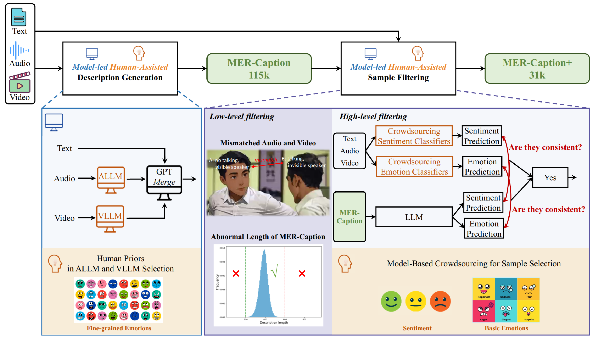

<p align="center">
       
<p>

<h3 align="center"><a href="https://openreview.net/pdf?id=Y8lfuSoqQz" style="color:#9C276A">
OV-MER &</a><a href="https://openreview.net/pdf?id=xmbdACI0xu" style="color:#9C276A">
AffectGPT &</a><a href="https://arxiv.org/pdf/2507.04278" style="color:#9C276A">
EmoPrefer</a></h3> 

<h5 align="center"> If our project helps you, please give us a star ⭐ on GitHub to support us. 🙏🙏 </h2>

<h5 align="center">


[](AffectGPT/LICENSE)
</h5>

## 🧠 Our Innovation (RAPO Extension)

This repository now includes our **RAPO extension** (Risk-Aware Preference + Ontology constraints) for open-vocabulary multimodal emotion recognition.

- **Unified auxiliary supervision**: training can consistently leverage `ovlabel`, `onehot`, `sentiment`, and `valence` annotations through one pipeline.
- **Risk-aware learning signal**: we introduce an auxiliary confidence objective to support selective prediction under uncertainty.
- **Open-vocabulary label optimization**: a multi-label auxiliary head improves emotion label coverage and robustness.
- **Plug-and-train integration**: new model architecture `affectgpt_rapo`, training config `AffectGPT/train_configs/ovmerd_rapo_train.yaml`, and usage guide `AffectGPT/RAPO_TRAINING.md`.

## ✨ OV-MER

**OV-MER** transitions from *traditional MER* to a framework that enables the prediction of *any number and category of emotions*, thereby advancing emotion AI toward real-world applicability by capturing the full spectrum of human emotions.

**(a) Task Comparison**: We compare the differences among three tasks (one-hot MER, multi-label MER, and OV-MER) across three aspects (label space, label number, and annotation manner).

**(b) Label Comparison**: We provide an example to visualize the one-hot and OV labels.


## 🚀 AffectGPT
We provide specifically designed framework, AffectGPT, for the OV-MER task.




## ✨ EmoPrefer
We propose **EmoPrefer**, a pioneering work exploring the potential of LLMs in decoding human emotion preferences. Specifically, we construct the first emotion preference dataset, **EmoPrefer-Data**, featuring high-quality preference annotations from experts. Additionally, we introduce **EmoPrefer-Bench**, which evaluates the performance of various MLLMs and prompting techniques in preference prediction, while also revealing new strategies to enhance their performance.


## 📑 Citation

If you find this project useful for your research and applications, please cite using this BibTeX:
```bibtex
# OV-MER task, OV-MERD dataset
@inproceedings{lian2025ov,
  title={OV-MER: Towards Open-Vocabulary Multimodal Emotion Recognition},
  author={Lian, Zheng and Sun, Haiyang and Sun, Licai and Chen, Haoyu and Chen, Lan and Gu, Hao and Wen, Zhuofan and Chen, Shun and Siyuan, Zhang and Yao, Hailiang and others},
  booktitle={Proceedings of the 42nd International Conference on Machine Learning},
  year={2025}
}

# MER-Caption dataset, MER-Caption+ dataset, AffectGPT Framework
@inproceedings{lian2025affectgpt,
  title={AffectGPT: A New Dataset, Model, and Benchmark for Emotion Understanding with Multimodal Large Language Models},
  author={Lian, Zheng and Chen, Haoyu and Chen, Lan and Sun, Haiyang and Sun, Licai and Ren, Yong and Cheng, Zebang and Liu, Bin and Liu, Rui and Peng, Xiaojiang and others},
  booktitle={Proceedings of the 42nd International Conference on Machine Learning},
  year={2025}
}

# EmoPrefer
@inproceedings{lian2026emoprefer,
  title={EmoPrefer: Can Large Language Models Understand Human Emotion Preferences?},
  author={Lian, Zheng and Sun, Licai and Chen, Lan and Chen, Haoyu and Cheng, Zebang and Zhang, Fan and Jia, Ziyu and Ma, Ziyang and Ma, Fei and Peng, Xiaojiang and others},
  booktitle={Proceedings of the International Conference on Learning Representations, {ICLR}},
  year={2026}
}

# EMER task
@article{lian2023explainable,
  title={Explainable Multimodal Emotion Recognition},
  author={Lian, Zheng and Sun, Haiyang and Sun, Licai and Gu, Hao and Wen, Zhuofan and Zhang, Siyuan and Chen, Shun and Xu, Mingyu and Xu, Ke and Chen, Kang and others},
  journal={arXiv preprint arXiv:2306.15401},
  year={2023}
}

# MER2023 Dataset
@inproceedings{lian2023mer,
  title={Mer 2023: Multi-label learning, modality robustness, and semi-supervised learning},
  author={Lian, Zheng and Sun, Haiyang and Sun, Licai and Chen, Kang and Xu, Mngyu and Wang, Kexin and Xu, Ke and He, Yu and Li, Ying and Zhao, Jinming and others},
  booktitle={Proceedings of the 31st ACM international conference on multimedia},
  pages={9610--9614},
  year={2023}
}

# MER2024 Dataset
@inproceedings{lian2024mer,
  title={Mer 2024: Semi-supervised learning, noise robustness, and open-vocabulary multimodal emotion recognition},
  author={Lian, Zheng and Sun, Haiyang and Sun, Licai and Wen, Zhuofan and Zhang, Siyuan and Chen, Shun and Gu, Hao and Zhao, Jinming and Ma, Ziyang and Chen, Xie and others},
  booktitle={Proceedings of the 2nd International Workshop on Multimodal and Responsible Affective Computing},
  pages={41--48},
  year={2024}
}

# MER2025 Dataset
@inproceedings{lian2025mer,
  title={Mer 2025: When affective computing meets large language models},
  author={Lian, Zheng and Liu, Rui and Xu, Kele and Liu, Bin and Liu, Xuefei and Zhang, Yazhou and Liu, Xin and Li, Yong and Cheng, Zebang and Zuo, Haolin and others},
  booktitle={Proceedings of the 33th ACM International Conference on Multimedia},
  year={2025}
}
```

## 👍 Acknowledgement
We evaluate the performance of various LLM-based baselines on OV-MERD, including [**SECap**](https://github.com/thuhcsi/SECap), [**SALMONN**](https://github.com/bytedance/SALMONN), [**Qwen-Audio**](https://github.com/QwenLM/Qwen-Audio), [**Otter**](https://github.com/Luodian/Otter), [**OneLLM**](https://github.com/csuhan/OneLLM), [**PandaGPT**](https://github.com/yxuansu/PandaGPT), [**VideoChat**](https://github.com/OpenGVLab/Ask-Anything/tree/main/video_chat), [**VideoChat2**](https://github.com/OpenGVLab/Ask-Anything/tree/main/video_chat2), [**Video-LLaMA**](https://github.com/DAMO-NLP-SG/Video-LLaMA), [**Video-LLaVA**](https://github.com/PKU-YuanGroup/Video-LLaVA), [**Video-ChatGPT**](https://github.com/mbzuai-oryx/Video-ChatGPT), [**LLaMA-VID**](https://github.com/dvlab-research/LLaMA-VID), [**mPLUG-Owl**](https://github.com/X-PLUG/mPLUG-Owl), and [**Chat-UniVi**](https://github.com/PKU-YuanGroup/Chat-UniVi). We extend our gratitude to the authors for their excellent work.

## 🔒 License

This project is released under the Apache 2.0 license as found in the LICENSE file. The service is a research preview intended for **non-commercial use ONLY**. Please get in touch with us if you find any potential violations.
